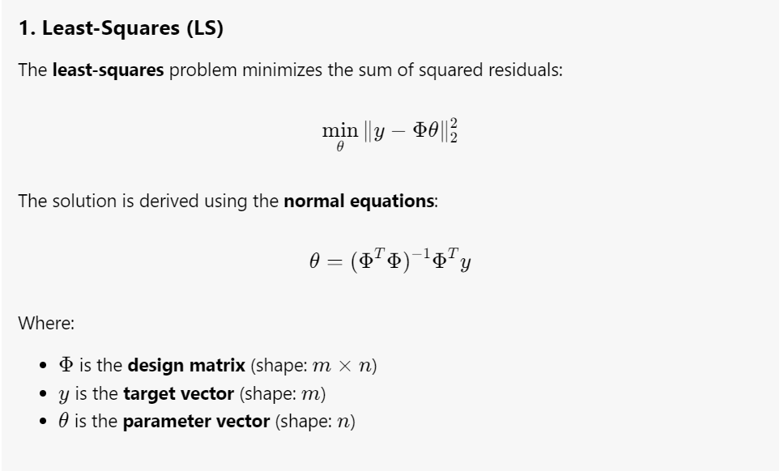
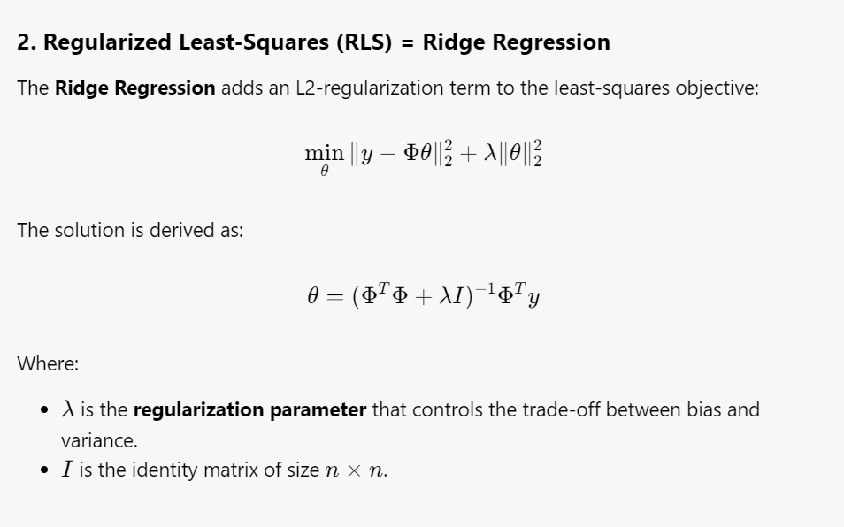
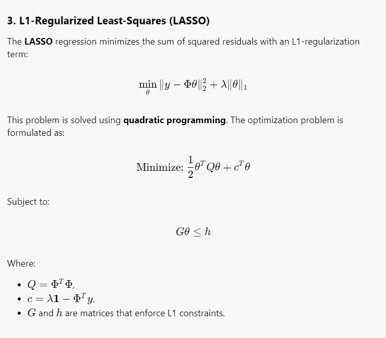
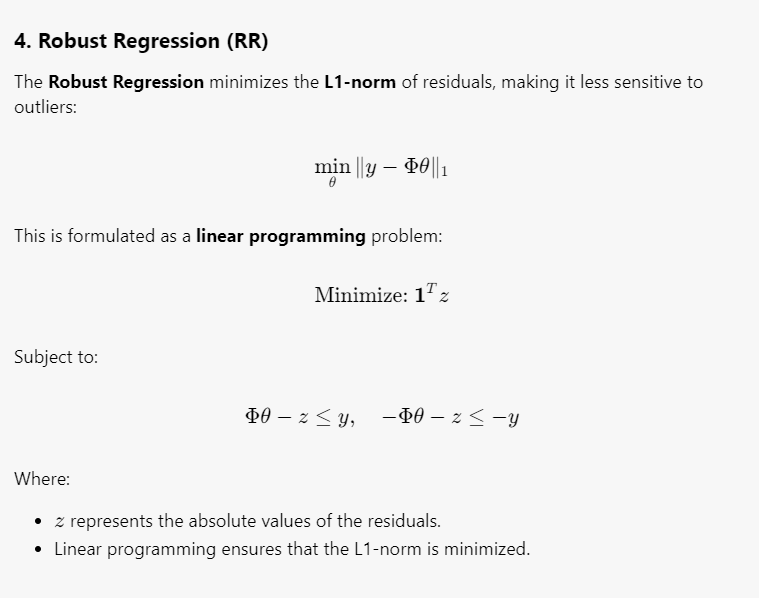

# **Regression Algorithms Implementations from Scratch with Python**

`regression_algorithms.py` implements four popular regression algorithms **using mathematical equations** and **minimizing the imports of existing libraries**.

---

## **Implemented Regression Algorithms**

1. **Ordinary Least-Squares (OLS)**  
2. **Regularized Least-Squares (RLS)** = **L2-regularized LS (Ridge Regression)**
3. **L1-regularized LS (LASSO)**  
4. **Robust Regression (RR)**  

---

## **Mathematical Equations**

  
  
<b>OLS Regression</b>

  
  
<b>Ridge Regression</b>

  
  
<b>LASSO</b>

  
  
<b>Robust Regression</b>

